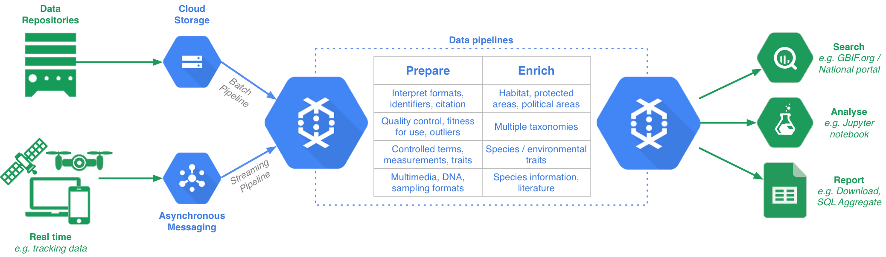

== Architecture

The data pipeline project comprises of a collection of components which can be used as libraries in your own project and a set of runnable pipelines built around https://beam.apache.org/[Apache Beam]. Beam provides the ability to execute the pipelines on a variety of target environments, such as a local Apache Spark cluster or on Google Cloud Dataflow. Additionally Beam provides excellent IO adapters to make it easy to source and sink data into a variety of datastores (e.g. Apache Solr, Elasticsearch, Apache HBase, Apache Kafka etc) and file formats (e.g. Apache Avro).

=== Deployment example 1: GBIF

